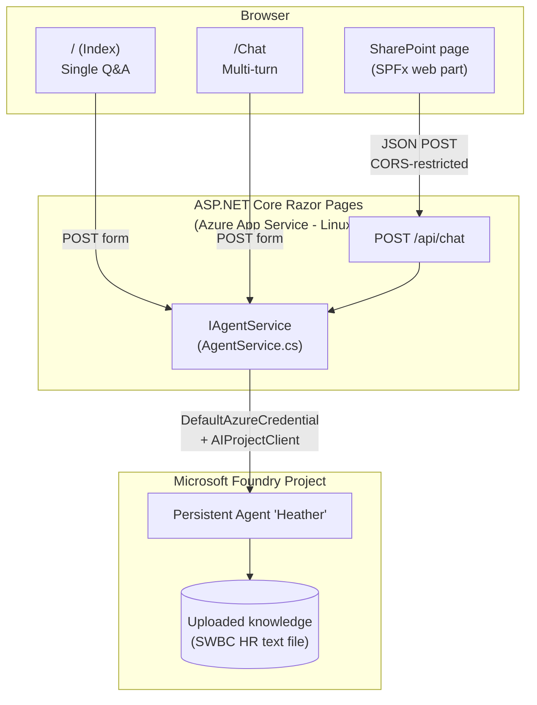

# Agent Heather — SWBC HR Policy Chat Assistant

[](https://dotnet.microsoft.com/download/dotnet/10.0)
[](https://azure.microsoft.com/services/app-service/)
[](https://learn.microsoft.com/azure/ai-foundry/)

**Agent Heather** is an ASP.NET Core Razor Pages web application that serves as an AI-powered HR policy assistant for **SWBC**. It is a thin UI in front of a **Microsoft Foundry Persistent Agent** named "Heather"; all retrieval, ranking, and grounding happen inside Foundry against a text knowledge file uploaded to the agent.

🌐 **Live Demo**: <https://heather-demo-chat.azurewebsites.net>

---

## Table of Contents

- [Features](#features)
- [Architecture](#architecture)
- [Knowledge Source](#knowledge-source)
- [Project Structure](#project-structure)
- [How It Works](#how-it-works)
- [Configuration](#configuration)
- [Prerequisites](#prerequisites)
- [Building & Running Locally](#building--running-locally)
- [Deployment](#deployment)
- [SharePoint SPFx Web Part](#sharepoint-spfx-web-part)
- [Notes & Caveats](#notes--caveats)

---

## Features

- **Single-Question Q&A** — Ask a one-off question on the home page (`/`) and get a grounded answer from Agent Heather.
- **Multi-Turn Chat** — Full conversational chat at `/Chat` with session-scoped message history.
- **Embeddable `/api/chat` endpoint** — A minimal HTTP endpoint consumed by the bundled SharePoint Framework (SPFx) web part so Heather can be embedded in SharePoint pages.
- **Foundry-grounded responses** — Every turn is sent to a Microsoft Foundry Persistent Agent that has been instructed (via system prompt) to answer **only** from its uploaded SWBC HR knowledge file.
- **Defense-in-depth grounding** — `AgentService` re-asserts the SWBC-only constraint on every run via `additionalInstructions`, in addition to the agent's own system prompt.
- **Managed-Identity friendly** — Uses `DefaultAzureCredential`, so the same code authenticates locally (Azure CLI / Visual Studio) and in Azure App Service (Managed Identity) without any code changes or secrets.
- **SPFx-iframe ready** — Cookie SameSite, anti-forgery, CORS, and CSP `frame-ancestors` are all pre-configured for embedding in SharePoint Online and the SPFx local workbench.

---

## Architecture



The web app does not perform any retrieval, chunking, embedding, or ranking of its own. Each request creates a Foundry thread, posts the user's history + new question, runs the agent, reads back the assistant's reply, and then deletes the thread.

---

## Knowledge Source

Heather's knowledge is **not loaded by this web app at runtime**. Instead:

1. SWBC HR/policy content was harvested from a public source as a single **text file**.
2. That text file was **uploaded to the Foundry agent** as a knowledge source.
3. Foundry handles indexing, retrieval, citation, and grounding inside the agent run.

This means there is **no PDF ingestion, no embeddings store, no TF-IDF, and no in-memory document service** in this repo. The `Services/PdfService.cs` and `Services/RetrievalService.cs` files referenced in older versions of this README have been removed.

To update Heather's knowledge:

1. Open the agent in the Foundry portal (the project endpoint and agent id are in `appsettings.json` under `AzureAIAgent`).
2. Replace or augment the uploaded knowledge file.
3. (Optional) Update the agent **Instructions** field — the recommended text is in `SystemMessage.md`.

No code change or redeploy of this web app is required to update Heather's knowledge.

---

## Project Structure

```text
HeatherDemoApp/
├── Models/
│   └── ChatMessage.cs                 # POCO: { Role, Content }, used for session history + Foundry replay
├── Pages/
│   ├── Shared/
│   │   ├── _Layout.cshtml             # Master layout (Bootstrap CDN, inline SVG avatar, top nav)
│   │   ├── _Layout.cshtml.css         # Scoped layout styles
│   │   └── _ValidationScriptsPartial.cshtml
│   ├── _ViewImports.cshtml
│   ├── _ViewStart.cshtml
│   ├── Index.cshtml / .cs             # Home page – single Q&A (stateless)
│   ├── Chat.cshtml / .cs              # Multi-turn chat (session-backed history)
│   ├── Privacy.cshtml / .cs           # Privacy policy
│   └── Error.cshtml / .cs             # Error page
├── Services/
│   ├── AgentService.cs                # Foundry Persistent Agents client wrapper (the active backend)
│   └── ChatApiService.cs              # ⚠️ Legacy / unused – see "Notes & Caveats"
├── wwwroot/
│   ├── css/, images/, js/, lib/       # Site assets (Bootstrap, jQuery, validation, etc.)
├── spfx-webpart/                      # Independent SharePoint Framework sub-project (built/deployed separately)
├── Program.cs                         # App startup, DI, middleware pipeline, /api/chat mapping
├── appsettings.json                   # AzureAIAgent endpoint + agent id, TargetSite metadata
├── appsettings.Development.json       # Dev-only logging overrides
├── appsettings.azure.json             # ⚠️ Legacy / unused – see "Notes & Caveats"
├── HeatherDemoApp.csproj              # .NET 10 Web SDK project (excludes publish/ and spfx-webpart/ from content)
├── HeatherDemoApp.sln                 # Solution file
├── SystemMessage.md                   # Recommended Foundry agent Instructions text
├── deploy_clean.ps1                   # Production deployment script (publish → zip → az webapp deploy --clean)
└── verify.ps1                         # Post-deployment smoke test
```

---

## How It Works

### Startup (`Program.cs`)

1. Reads `WEBSITES_PORT` / `PORT` env vars and binds Kestrel to `http://0.0.0.0:<port>`.
2. Registers Razor Pages, distributed memory cache, session, anti-forgery, and a `SharePointSPFx` CORS policy that allows `https://*.sharepoint.com`, `https://*.sharepoint.us`, and `https://localhost:4321` (SPFx local workbench).
3. Registers `IAgentService` → `AgentService` as a **singleton** (the Foundry SDK clients are thread-safe and intended for reuse).
4. Configures cookies for SharePoint iframe embedding (`SameSite=None; Secure`).
5. Replaces `X-Frame-Options` with a CSP `frame-ancestors` directive that whitelists SharePoint and `localhost:*`.
6. Maps Razor Pages and the minimal `POST /api/chat` endpoint (CORS-restricted to the `SharePointSPFx` policy).

### A chat turn (`Services/AgentService.cs`)

For both the Razor pages and the `/api/chat` endpoint, every turn does the following:

1. **Resolve the agent** via `_agentsClient.Administration.GetAgent(_agentId)` (also serves as a permission check).
2. **Create a fresh Foundry thread** (`Threads.CreateThread()`) — one per request, to keep users isolated.
3. **Replay history** — for the multi-turn `/Chat` page, prior `ChatMessage`s are posted to the thread (mapping `assistant` → `MessageRole.Agent`, everything else → `MessageRole.User`).
4. **Post the new user question** as a `MessageRole.User` message.
5. **Start a run** with hard-coded `additionalInstructions` that re-assert the SWBC-only constraint as a defense-in-depth measure on top of the agent's own system prompt.
6. **Poll** until the run leaves `Queued`/`InProgress`. Anything other than `Completed` returns a friendly error to the caller.
7. **Read the latest agent message** (descending order) and concatenate every `MessageTextContent` block into the response.
8. **Delete the thread** in a `finally` block (best-effort cleanup).

### Session history (`Pages/Chat.cshtml.cs`)

Conversation state for the `/Chat` page is stored in `HttpContext.Session` under the key `"chat_history"` as a JSON-serialized `List<ChatMessage>`. The session itself is backed by `AddDistributedMemoryCache()`, which is fine for single-instance App Service plans but **must be replaced** with Redis or SQL if you scale out.

### `/api/chat` (for the SPFx web part)

`Program.cs` maps a minimal endpoint:

```text
POST /api/chat
Content-Type: application/json

{ "message": "How many sick days do I get?" }
```

It deserializes into `ChatApiRequest(string? Message)`, validates the `message` field is non-empty, calls `IAgentService.AskAsync(message)`, and returns `{ "response": "..." }`. The endpoint is locked down to the `SharePointSPFx` CORS policy via `RequireCors("SharePointSPFx")`.

---

## Configuration

### `appsettings.json`

```json
{
  "AzureAIAgent": {
    "Endpoint": "https://<your-foundry-resource>.services.ai.azure.com/api/projects/<your-project>",
    "AgentId":  "asst_xxxxxxxxxxxxxxxxxxxxxxxx"
  },
  "TargetSite": {
    "Url":         "https://www.swbc.com/",
    "Name":        "SWBC",
    "ShortName":   "SWBC",
    "Description": "Ask Heather questions about SWBC HR policies, procedures, and benefits",
    "WelcomeItems": [ "..." ]
  }
}
```

`AzureAIAgent.Endpoint` and `AzureAIAgent.AgentId` are **required**. `AgentService` throws `InvalidOperationException` at startup if either is missing — there is no silent fallback. To override per environment, use the standard ASP.NET Core configuration system (e.g. App Service application settings using `AzureAIAgent__Endpoint` / `AzureAIAgent__AgentId`).

`TargetSite` is currently metadata-only — it is not consumed by any view today, but is checked into source control so the deployed config always documents the intended target organization.

### Authentication

`AgentService` constructs a `DefaultAzureCredential` with `ExcludeVisualStudioCodeCredential` and `ExcludeInteractiveBrowserCredential` set, which means the credential chain effectively reduces to:

- **Locally**: Azure CLI (`az login`) or Visual Studio.
- **In Azure**: the App Service's system-assigned (or user-assigned) Managed Identity.

Either principal must hold a role on the Foundry project that allows it to invoke the agent (e.g. `Azure AI Developer` on the project resource).

> ⚠️ There are no API keys in this app and none should be added. All Foundry calls authenticate via Entra ID tokens.

---

## Prerequisites

- [.NET 10 SDK](https://dotnet.microsoft.com/download/dotnet/10.0)
- [Azure CLI](https://learn.microsoft.com/cli/azure/install-azure-cli) (for deployment and local auth)
- Access to the Foundry project that hosts the Heather agent (role: `Azure AI Developer` or higher)

---

## Building & Running Locally

```powershell
# Authenticate so DefaultAzureCredential can pick up your token
az login

# From the project root:
dotnet run
```

The app binds to `http://0.0.0.0:80` by default. To use a different port, set `PORT` (or `WEBSITES_PORT`) before running:

```powershell
$env:PORT = "5046"
dotnet run
```

Or pass `--urls` directly:

```powershell
dotnet run --urls http://localhost:5046
```

---

## Deployment

The app is deployed to **Azure App Service (Linux)** as a framework-dependent zip. The canonical deployment script is `deploy_clean.ps1`.

### Target

| Setting | Value |
| --- | --- |
| Subscription | `Marc Merritt – MPN` |
| Resource group | `RG-Marc.Merritt` |
| App Service | `heather-demo-chat` |
| Public URL | <https://heather-demo-chat.azurewebsites.net> |

### One-line deploy

```powershell
az login                      # if you aren't already
.\deploy_clean.ps1
.\verify.ps1                  # optional smoke test
```

### What `deploy_clean.ps1` does

1. **Acquire an ARM token** via `az account get-access-token`.
2. **Reap stale failed deployments** — calls Kudu's `/api/deployments` and `DELETE`s any record with `status == 3` (Failed). This prevents a previous failure from blocking the next deploy.
3. **Publish** — `dotnet publish HeatherDemoApp.csproj -c Release -r linux-x64 --self-contained false` to `C:\temp\heather_deploy`.
4. **Disable Oryx server-side build** — writes `.deployment` with `SCM_DO_BUILD_DURING_DEPLOYMENT=false` into the publish output.
5. **Build a forward-slash zip** — assembles entries one-by-one with `ZipFileExtensions.CreateEntryFromFile` and explicitly converts `\` → `/` in entry names. **This step matters**: `[System.IO.Compression.ZipFile]::CreateFromDirectory` on Windows produces backslash entry names, which the Linux App Service rsync rejects with `Invalid argument (22)`.
6. **Deploy** — `az webapp deploy --type zip --clean true`. The `--clean true` flag wipes `/home/site/wwwroot` first, which is important because the `--src-path` zip is incremental by default and previous failed deploys may have left malformed file names on the site.
7. **Restart** — `az webapp restart`.

### What the `.csproj` is doing for you

`HeatherDemoApp.csproj` includes:

```xml
<DefaultItemExcludes>$(DefaultItemExcludes);publish\**;publish/**;spfx-webpart\**;spfx-webpart/**</DefaultItemExcludes>
```

This prevents two common bundling mistakes:

- **`publish/`** — any ad-hoc `dotnet publish -o publish` output (also `.gitignore`d) gets recursively swept into the next publish output and ends up at `/home/site/wwwroot/publish/...`.
- **`spfx-webpart/`** — the SharePoint Framework sub-project's TypeScript source has nothing to do with the .NET app and would otherwise be deployed as content (introducing literal `\` characters in path segments on Linux).

Without this, deploys to App Service Linux fail at the rsync step.

### Verify

```powershell
.\verify.ps1
```

Waits 30 seconds for the app to start, then GETs <https://heather-demo-chat.azurewebsites.net> and checks for the inline `heather-avatar` SVG marker in the HTML.

---

## SharePoint SPFx Web Part

A SharePoint Framework web part lives under `spfx-webpart/` and consumes the `POST /api/chat` endpoint exposed by this app. It is a **separate sub-project** with its own build chain (`gulp`, `npm`) and is built and deployed to SharePoint independently of this .NET project. The `HeatherDemoApp.csproj` explicitly excludes it from the .NET build/publish output.

The web part is allowed cross-origin by the `SharePointSPFx` CORS policy in `Program.cs`, which permits any subdomain of `*.sharepoint.com` / `*.sharepoint.us` and the SPFx local workbench at `https://localhost:4321`.

---

## Notes & Caveats

- **`Services/ChatApiService.cs` is dead code.** It is a legacy HTTP wrapper around an Azure Function chat API that this app no longer uses. It is **not registered in `Program.cs`** and has no consumers. Leaving it in place for now to keep the diff small; safe to delete in a future cleanup.
- **`appsettings.azure.json` is not loaded by ASP.NET Core.** Despite the suggestive filename, it is a JSON array of name/value pairs (not a valid configuration file) and is not referenced by `deploy_clean.ps1`. Likely an abandoned input for `az webapp config appsettings set --settings @appsettings.azure.json`. Safe to delete.
- **Threads are created and deleted per request.** This keeps users isolated and avoids accumulating per-user thread state in Foundry, but it means every turn pays the full cost of replaying history. For higher-volume use cases consider a per-session thread cached in distributed state.
- **In-memory session is single-instance only.** `AddDistributedMemoryCache()` does not survive a restart and does not work across multiple App Service instances. Replace with Redis (`AddStackExchangeRedisCache`) or SQL Server distributed cache if you scale out.
- **The Foundry project is shared.** `appsettings.json` currently points at a multi-tenant Foundry project. The agent ID is the Heather agent within that project. If SWBC requires its own dedicated Foundry project, both values can be changed without code edits.

---

## License

This project is for demonstration purposes.
